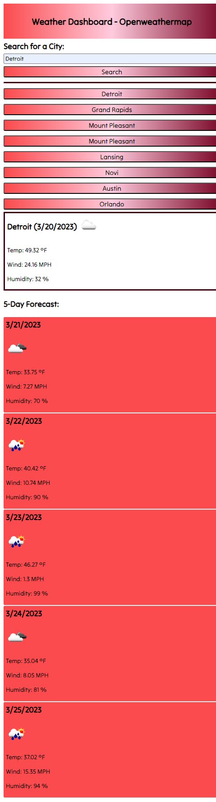
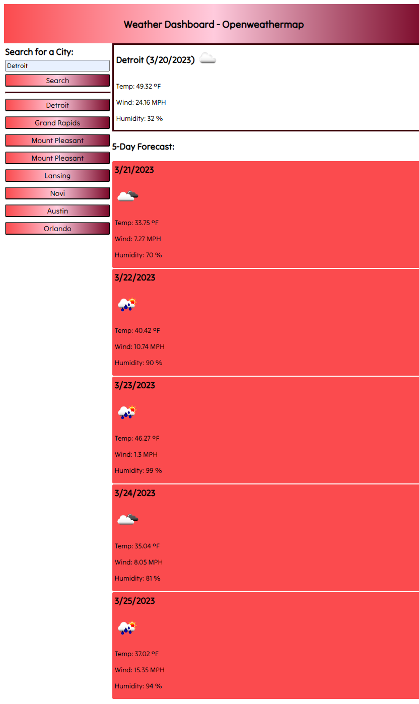
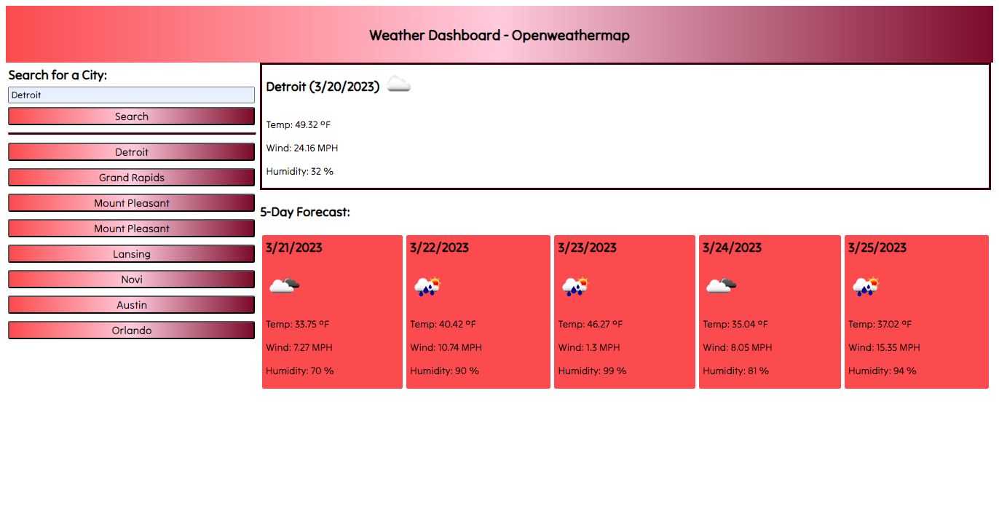
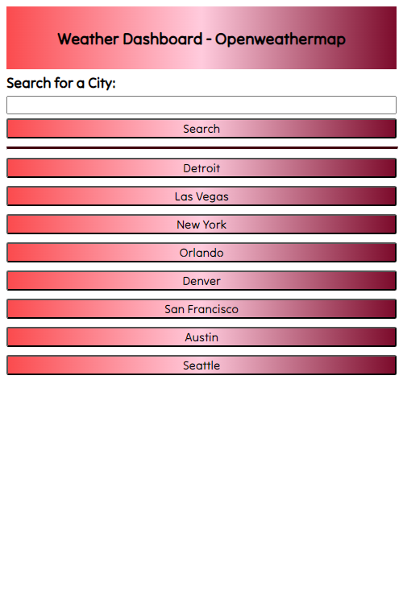

# weather-dashboard-openweather

## Description

Provide a short description explaining the what, why, and how of your project. Use the following questions as a guide:

- What was your motivation?
- Why did you build this project? (Note: the answer is not "Because it was a homework assignment.")
- What problem does it solve?
- What did you learn?

## Table of Contents

- [UserStory](#userstory)
- [AcceptanceCriteria](#acceptancecriteria)
- [Usage](#usage)
- [Credits](#credits)

## UserStory

AS A traveler  
I WANT to see the weather outlook for multiple cities  
SO THAT I can plan a trip accordingly  

## AcceptanceCriteria

GIVEN a weather dashboard with form inputs  
WHEN I search for a city  
THEN I am presented with current and future conditions for that city and that city is added to the search history  
WHEN I view current weather conditions for that city  
THEN I am presented with the city name, the date, an icon representation of weather conditions, the temperature, the humidity, and the the wind speed  
WHEN I view future weather conditions for that city  
THEN I am presented with a 5-day forecast that displays the date, an icon representation of weather conditions, the temperature, the wind speed, and the humidity  
WHEN I click on a city in the search history  
THEN I am again presented with current and future conditions for that city  

## Usage

[Link to the Deployed Webpage](https://KevinRhode.github.io/weather-dashboard-openweather/)  

[Link to the Repo](https://github.com/KevinRhode/weather-dashboard-openweather)

  
  
  
Preloaded Cites  

## Credits

[String Formating like C# String.Format {0}](https://stackoverflow.com/questions/610406/javascript-equivalent-to-printf-string-format)

[Creating a quick divider](https://www.w3schools.com/howto/howto_css_dividers.asp)

[Color Patltee Slector](https://coolors.co/3e000c-fb4b4e-ffcbdd-7c0b2b-d10000)